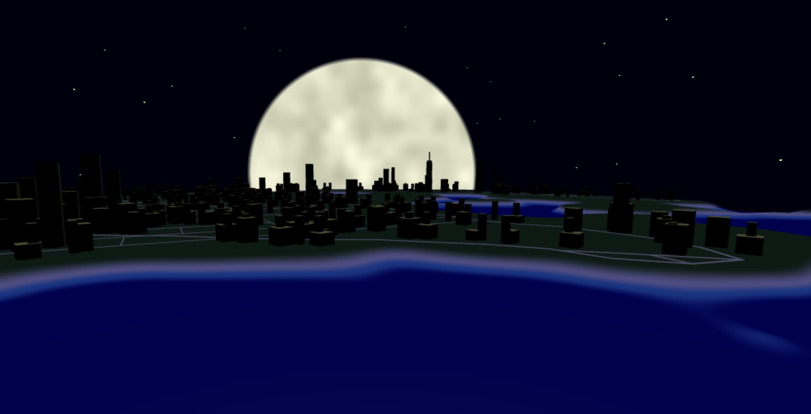

# Homework 6: City Generation

## Overview
My project is a simple city in a nightime environment. The buildings end environment themselves are unfortunately pretty simple, as I ran out of time to do anything too interesting with them. However, because I found my end result of homework 5 to be unsatisfying, I spent much of my time reworking the road generation, to the point where I essentially just rewrote the entire thing. The final highway and grid patterns are much more interesting than they were in my previous assignment.

## Road Generation
As mentioned, my road generation system was completely reworked. Instead of using a single, branching turtle, I now use a collection of turtles, one for each branch still being grown. This way, the turtles can create roads in parallel. The actual backroad generation is not done by the turtles; each turtle has a type (highway or street), and highways have a chance of branching at a 90 degree angle and becoming streets, at which point they can only move in 90 degree increments. By giving the turtles types themselves, highways and roads can determine which types of roads they intersect, and adjust accordingly. Moreoever, the noise functions I used for population and terrain generation have been simplified, so the maps are more or less synced between the GPU and CPU.

## Building Placement
As specified in the writeup, I created a grid spanning the entire scene, and then "rasterized" the road network to determine where not to place buildings. To accomplish this, I simply took all the line segments that made up the grid, and used the same intersection testing function I wrote for the road generation. Each cell can be in one of 3 states: empty, meaning there's nothing in the cell, but we won't spawn a building there, unavailable, meaning a building can't be spawned in that cell for whatever reason, and available, meaning the cell is available to the pool of cells that will be considered when placing a new building. All cells start out as empty, and the ones in the water are immediately marked unavailable. Any cell with a road running through it is also marked unavailable, but all empty (not unavailable) adjacent cells are then marked available. This ensures that all the buildings we place are right next to a street or highway, and that we don't get a building in the middle of nowhere.

## Building Generation
To create the buildings, I created a regular prism drawable, and created 4 instances: a regangular, pentagonal, hexogonal, and octogonal prism. These instances then form the buildings more or less in the manner specified in the project requirements: up to 4 layers are extruded downward, each layer being one of the 4 available shapes (acheived through instanced geometry). The shapes used, number of layers, height of each layer, and lateral layer offset can vary between buildings, creating some variation, though the number of layers and layer heights generally incrase with population. I wanted to manually create more complex buildings (or perhaps just building layers that could be stitched together procedurally) using Blender, but these were a busy past couple of weeks, so unfortunately, the buildings still look rather bland up close. However, I was able to create a hard-coded skyscraper-like building just using rectangular prisms that has a small chance of spawning instead of a procedural building in areas of high population.

## References
As expected, I used the paper provided for this assignment, as well as the one from the previous assignment. I also referenced past homework assignments heavily, particularly homework 1.
More importantly though, I found a presentation online explaining a possible implementation of the paper for homework 5. (https://phiresky.github.io/procedural-cities/). I had a very hard time implementing the last assignment, so this was extremely helpful

## Demo Link